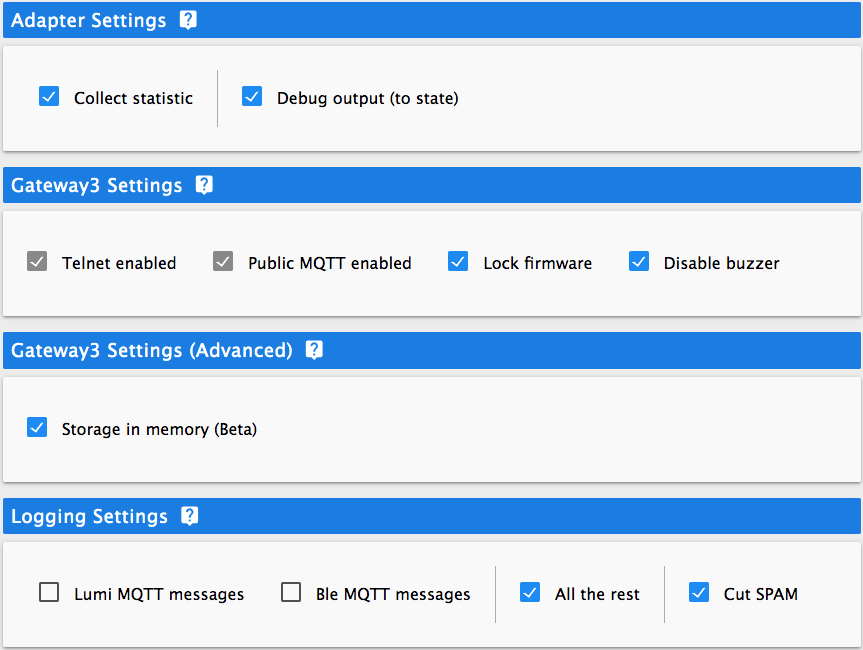

# ioBroker.xiaomi-gateway3

<!--  -->

## Early Alpha version

For now adapter is in very early development.
- scanty documentation (but it will be supplemented)
- it supports only Zigbee devices
- ...

## Xiaomi-gateway3 ioBroker adapter

This adapter allow ioBroker to communicate with Xiaomi Gateway 3 and use it to control Xiaomi devices.
Adapter communicates with gateway over MQTT protocol (it connects to build-in MQTT broker). However you have to pair your gateway and devices by Mi Home (Cloud).

## Hardware and limits

Adapter supports `Xiaomi Gateway 3 (ZNDMWG03LM and ZNDMWG02LM)` running on original firmware these versions:
- `v1.5.0_0026` (developed on it)
- `v1.5.0_0102` (similar to `1.5.0_0026`, but not tested)

Optionally you can flash gateway with custom or stock firmware other version: [wiki](https://github.com/AlexxIT/XiaomiGateway3/wiki).

## Configuration

To connect a gateway you need get ip and token of gateway. You can do this manually or from cloud. Also you have to chose telnet open command (in most cases option #2).
You can test connection and telnet by buttons.

You have several options to configure adapter and gatewey.

## Changelog
<!--
    Placeholder for the next version (at the beginning of the line):
    ### **WORK IN PROGRESS**
-->
### 0.0.1-alpha.0 (2021-10-13)
* (Evgenii Abramov) Initial release

## License
MIT License

Copyright (c) 2021 Evgenii Abramov <john.abramov@gmail.com>

Permission is hereby granted, free of charge, to any person obtaining a copy
of this software and associated documentation files (the "Software"), to deal
in the Software without restriction, including without limitation the rights
to use, copy, modify, merge, publish, distribute, sublicense, and/or sell
copies of the Software, and to permit persons to whom the Software is
furnished to do so, subject to the following conditions:

The above copyright notice and this permission notice shall be included in all
copies or substantial portions of the Software.

THE SOFTWARE IS PROVIDED "AS IS", WITHOUT WARRANTY OF ANY KIND, EXPRESS OR
IMPLIED, INCLUDING BUT NOT LIMITED TO THE WARRANTIES OF MERCHANTABILITY,
FITNESS FOR A PARTICULAR PURPOSE AND NONINFRINGEMENT. IN NO EVENT SHALL THE
AUTHORS OR COPYRIGHT HOLDERS BE LIABLE FOR ANY CLAIM, DAMAGES OR OTHER
LIABILITY, WHETHER IN AN ACTION OF CONTRACT, TORT OR OTHERWISE, ARISING FROM,
OUT OF OR IN CONNECTION WITH THE SOFTWARE OR THE USE OR OTHER DEALINGS IN THE
SOFTWARE.